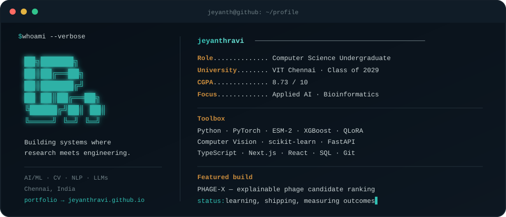

<div align="center">
  
</div>

<div align="center">
  <a href="https://jeyanthravi.github.io/"></a>
  <a href="https://www.linkedin.com/in/jeyanth-ravi-2bba3a371/"></a>
  <a href="mailto:jeyanth.r2025@vitstudent.ac.in"></a>
</div>

### `> selected_work`

| Project | What it does | Stack |
|---|---|---|
| **[PHAGE-X](https://jeyanthravi.github.io/#work)** | Ranks phage candidates for an uploaded *K. pneumoniae* isolate, explains compatibility signals, and proposes a complementary laboratory-testing shortlist with strict evidence gates. | ESM-2, XGBoost, FastAPI, React |
| **[Amazon ML Challenge 2026](https://github.com/JeyanthRavi/Amazon_ML)** | Entity-resolution pipeline with 23 similarity features; achieved **0.857 public macro F0.5**. | Python, boosted trees |
| **[VERBA](https://github.com/JeyanthRavi/verba)** | Argues both sides of a dispute independently, synthesizes evidence, and converts reviewed findings into an agreement. **[Live ↗](https://pslang-ai-judge.vercel.app)** | Next.js, GenAI, secure workflows |
| **[VisualQA India](https://github.com/JeyanthRavi/visualqa-india)** | Combines road-damage detection and visual question answering to generate evidence-backed safety scores. | YOLO, BLIP-2, Python |
| **[Llama 3.2 QLoRA](https://github.com/JeyanthRavi/llama-3.2-1b-qlora-finetuning)** | A 4-bit supervised fine-tuning pipeline designed for a single NVIDIA T4. | Unsloth, TRL, PEFT |
| **[Brain Tumor MRI Benchmark](https://github.com/JeyanthRavi/brain-tumor-mri-classification)** | Compares six CNN and Transformer architectures across four MRI classes. | PyTorch, computer vision |
| **[BERT Sentiment](https://github.com/JeyanthRavi/bert-movie-sentiment)** | Fine-tunes BERT on IMDb reviews with weighted-F1 evaluation and confidence-scored inference. | Transformers, CUDA |
| **[House Price Regression](https://github.com/JeyanthRavi/house-price-linear-regression)** | Demonstrates a complete validated regression workflow with persistence, plotting, CLI inference, and tests. | Python, scikit-learn |

### `> current_processes`

```text
[running]  multimodal learning
[running]  efficient LLM adaptation
[running]  trustworthy AI workflows
[always]   turning experiments into reproducible systems
```

### `> stack`

<p>
  
</p>

---

<sub>Computer Science @ VIT Chennai · Expected 2029 · Chennai, India</sub>
